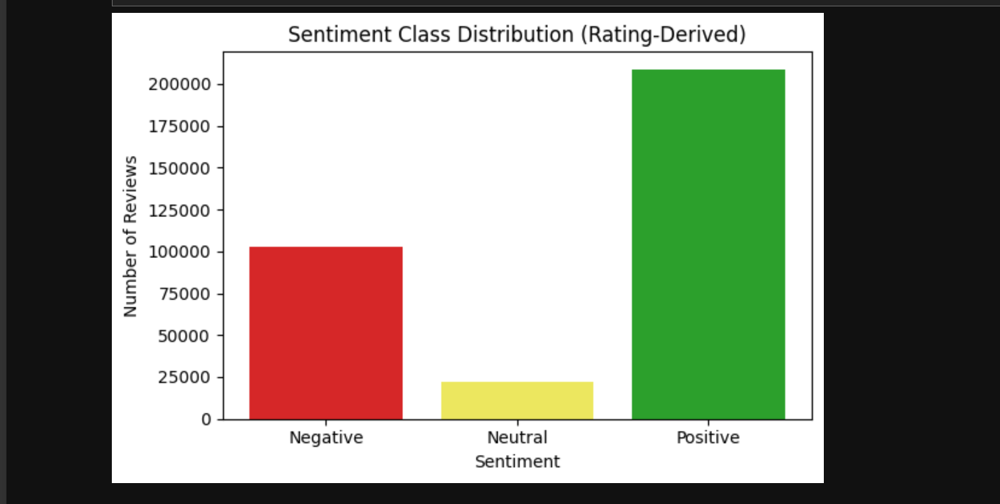
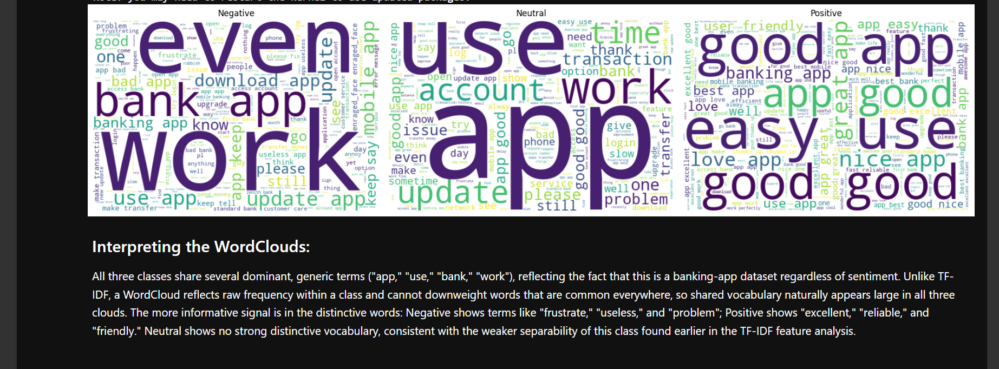
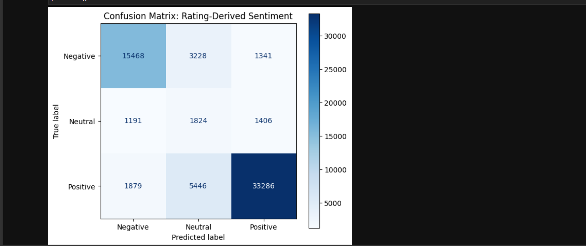
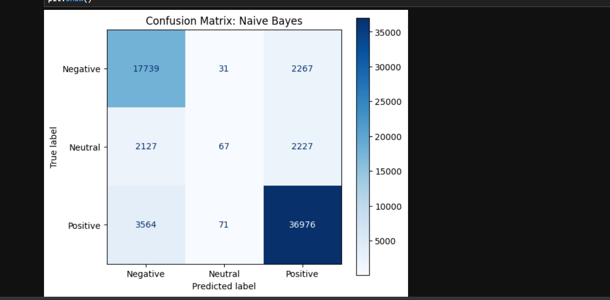

# Sentiment Analysis of Nigerian Mobile Banking App Reviews

Oasis Infobyte Internship Program (OIBSIP), Data Analytics track, Task 4

This project sorts reviews of Nigerian banking apps into Negative, Neutral or Positive using only the review text. I trained two models, Logistic Regression and Multinomial Naive Bayes, and compared them. Naive Bayes had the higher accuracy (0.84 against 0.78), but it almost never predicted Neutral. Logistic Regression had the higher macro F1 (0.6384 against 0.5821), so I treat it as the better model in this experiment. The sentiment labels come from star ratings, not from people reading and tagging each review, and that explains a lot of what I found.

## Contents

1. [Introduction](#1-introduction)
2. [Data](#2-data)
3. [Data preparation](#3-data-preparation)
4. [Exploring the data](#4-exploring-the-data)
5. [Modelling](#5-modelling)
6. [Results](#6-results)
7. [Error analysis](#7-error-analysis)
8. [Research questions: what I found](#8-research-questions-what-i-found)
9. [Limitations](#9-limitations)
10. [Possible application](#10-possible-application)
11. [Next steps (not done)](#11-next-steps-not-done)
12. [Conclusion](#12-conclusion)
13. [Internship checklist](#13-internship-checklist)
14. [Project structure and how to run it](#14-project-structure-and-how-to-run-it)

## 1. Introduction

### Background
People who use Nigerian banking apps leave reviews with a star rating and a short comment. The dataset used here has over 330,000 of them across 16 banks. A star rating shows how someone scored the app, but it doesn't say what they liked or what annoyed them, and nobody can read that many comments one by one.

### Problem statement
Star ratings are easy to count but they don't explain much, and reading comments by hand doesn't scale. This project tests whether a model can sort reviews into Negative, Neutral and Positive from the comment text alone, and how well it does that for each of the three groups.

### Objectives
1. Load and combine the review files from 16 banks, then clean them.
2. Build sentiment labels from the star ratings and check how balanced the classes are.
3. Turn the text into TF-IDF features and train Logistic Regression and Multinomial Naive Bayes on the same features.
4. Evaluate both models with accuracy, precision, recall, F1 and confusion matrices, and compare them using macro F1 because the classes are uneven.
5. Read misclassified reviews to understand the errors.

I did not set a target score before starting.

### Research questions
1. Can the review text alone predict the sentiment category taken from the star rating?
2. Which model handles the uneven class sizes better, Logistic Regression or Multinomial Naive Bayes?
3. Why is the Neutral class so hard for both models?
4. Does the label taken from the star rating always match what the review text says?

## 2. Data

### Source
The data is the Nigerian Bank App Reviews dataset from Federal University Lokoja, on Hugging Face (`Federal-University-Lokoja/Bank-Review`). It comes as one CSV file per bank, and I downloaded all 16 with `huggingface_hub` and combined them. The internship suggests Kaggle as a starting point, but this dataset is from Hugging Face.

Banks included: Access Bank, EcoBank, FCMB, Fidelity Bank, First Bank of Nigeria, GTBank, Jaiz Bank, Keystone Bank, Polaris Bank, Stanbic IBTC, Sterling Bank, UBA, Union Bank, Unity Bank, Wema Bank and Zenith Bank. The number of reviews per bank varies a lot, from 87,609 for UBA to 927 for Unity Bank.

### Data dictionary

Combined raw data: 334,415 rows and 4 columns.

| Column | Type | Meaning |
|---|---|---|
| year | integer | Year the review was posted |
| content | text | The review text |
| score | integer | Star rating from 1 to 5 |
| bank | text | Bank name. I added this when loading each file so I wouldn't lose track of which bank a review came from |

Columns I created during the project: `word_count`, `rating_derived_sentiment`, `cleaned_text`, `tokens`, `tokens_no_stopwords`, `lemmatized_tokens` and `group_key`.

### How the labels were made
The dataset has no sentiment column, so I made one from the star rating.

| Stars | Label | Reviews (after cleaning) |
|---|---|---|
| 1 or 2 | Negative | 102,994 (30.85%) |
| 3 | Neutral | 22,212 (6.65%) |
| 4 or 5 | Positive | 208,615 (62.49%) |

This is the most important thing to know about the project. These labels describe the rating the person gave, not the sentiment I or anyone else read in the text.

### Ethical note
These are public app reviews. The dataset has no reviewer name or ID columns. I did not check the review text for personal details that people may have typed in, and I only used the text to train and test models.

## 3. Data preparation

| Step | What I did | Result |
|---|---|---|
| Missing text | Removed rows with no review text | 123 rows removed, 334,292 left |
| Duplicates | Removed exact duplicates (same year, text, score and bank) only for reviews of 5 or more words | 333,821 rows left |
| Cleaning | Lowercased the text, expanded contractions (can't became cannot), turned emojis into words, removed punctuation and extra spaces | New column `cleaned_text` |
| Tokenizing | Split each review into words with NLTK `word_tokenize` | New column `tokens` |
| Stopwords | Used the NLTK English list but kept no, nor, not, never and cannot, because negations change the meaning of a review | New column `tokens_no_stopwords` |
| Lemmatizing | Used the WordNet lemmatizer with part of speech tags (trying became try, reasons became reason, frustrating became frustrate) | New column `lemmatized_tokens` |

### Why duplicates were handled this way
There were 74,962 exact duplicate rows. Of the 86,224 rows that belong to a duplicate group, 53,315 are one word reviews and 23,579 are two word reviews, things like "Awesome", "Good" and "Bad". Different customers can easily write the same short word on their own, so I did not treat those as copies. Removing every duplicate would also have deleted a large chunk of the dataset. For reviews of 5 or more words, an exact match is much less likely to be a coincidence, so I removed those. The cutoff of 5 is my own judgement. I did not test other cutoffs. In the end only 471 rows were removed this way.

### Why lemmatizing needed extra care
The part of speech tagger works poorly on a single word with no context. When I tagged one word reviews like "perfect" and "excellent" on their own, many came back as nouns. So I tag using the full token list from before stopword removal, and for one word reviews I add "it is" in front of the word for the tagging step only. Those two extra words are never added to the data. Some words, like "lovely" and "wow", still get an odd tag, but that doesn't change their lemma.

## 4. Exploring the data



Positive reviews make up a bit under two thirds of the data and Neutral reviews are only 6.65%. This imbalance is the reason I use macro F1 later.



I made one WordCloud per class from the lemmatized tokens. The biggest words in all three are the same generic ones (app, use, bank, work), because every review is about a banking app. A WordCloud only shows frequency, so it can't push those words down the way TF-IDF does. The more useful signal is in the smaller words. Negative has words like frustrate, useless and problem. Positive has excellent, reliable and friendly. Neutral has no clear set of its own words, which matches how hard that class turned out to be.

## 5. Modelling

### Train and test split
Many short reviews repeat word for word. "good" alone appears 18,245 times, about 5.5% of the dataset. A normal random split would put copies of the same review in both train and test, and the model would be scored on text it had already seen. So I grouped rows by their lowercased, trimmed review text (213,784 unique texts) and used `GroupShuffleSplit` with `test_size=0.2` and `random_state=42`. Each text group goes entirely to train or entirely to test. I checked this, and zero groups appear in both sets.

Because whole groups move together, the row level split is not exactly 80/20.

| Set | Rows | Share |
|---|---|---|
| Train | 268,752 | 80.51% |
| Test | 65,069 | 19.49% |

The class mix stayed close in both sets (Positive 62.5% and 62.4%, Negative 30.9% and 30.8%, Neutral 6.6% and 6.8% for train and test).

### TF-IDF
TF-IDF turns each review into numbers a model can use. A word gets a higher score when it appears often in a review but is not common across all reviews. So a word like "app" counts for little, and a word like "useless" counts for more. I fitted the vectorizer on the training data only and then used it to transform the test data, so nothing from the test set shaped the vocabulary.

I set `max_features=5000` and `min_df=10`. The `min_df` setting drops words that appear in fewer than 10 reviews, because the plain 5,000 word vocabulary included one off emoji tokens and stray fragments. The final vocabulary has 4,492 features.

### Models
Both models were trained on the same TF-IDF features.

- **Logistic Regression** with `class_weight="balanced"` (so the small Neutral class counts for more during training), `max_iter=1000` and `random_state=42`.
- **Multinomial Naive Bayes** with default settings. It has no class weight option.

## 6. Results

| Model | Accuracy | Macro precision | Macro recall | Macro F1 |
|---|---|---|---|---|
| Logistic Regression | 0.78 | 0.64 | 0.67 | 0.6384 |
| Multinomial Naive Bayes | 0.84 | 0.68 | 0.60 | 0.5821 |

F1 by class:

| Model | Negative | Neutral | Positive |
|---|---|---|---|
| Logistic Regression | 0.80 | 0.24 | 0.87 |
| Multinomial Naive Bayes | 0.82 | 0.03 | 0.90 |





### Reading the results
Naive Bayes scores higher on accuracy because it does well on the two big classes. But it found only 67 of the 4,421 Neutral reviews in the test set (recall 0.02). Logistic Regression finds many more of them (recall 0.41), but its Neutral precision is only 0.17, so most of the reviews it calls Neutral are not.

Macro F1 gives the three classes equal weight, so it shows the Neutral problem that accuracy hides. By macro F1, Logistic Regression is ahead (0.6384 against 0.5821), and that is why I call it the better model here. It is still weak on Neutral, with an F1 of 0.24.

Naive Bayes has no class weight and Logistic Regression does, and the gap in Neutral recall fits that. But I never ran either model with the other's setting, so I can't say how much of the gap comes from it.

## 7. Error analysis

I looked at Logistic Regression's mistakes on reviews whose true label is Neutral, 5 predicted Positive and 5 predicted Negative. I did not look at errors between Positive and Negative, and I did not do this for Naive Bayes. Five of the examples:

| Review | True label | Predicted | My reading of the text |
|---|---|---|---|
| It's wow keep up the good work | Neutral (3 stars) | Positive | Reads as positive |
| Wonderful | Neutral (3 stars) | Positive | Reads as positive |
| Very nice app iam really aprt | Neutral (3 stars) | Positive | Reads as positive |
| Uh. Hm | Neutral (3 stars) | Positive | No clear sentiment |
| For two days now i can't access the app | Neutral (3 stars) | Negative | Reads as a complaint |

In several of these, the model's answer is reasonable from the text alone. The review was labelled Neutral only because the person gave 3 stars. So some of these "errors" come from the labels, not only from the model. I only looked at a small sample, so I can't say how common this is across the whole Neutral class.

### Words the model relied on
For Logistic Regression, the top Negative words include useless, stupid, worst and terrible. The top Positive words include fantabulous, magnificent, best and awesome. Emoji tokens such as `heart_suit` and `enraged_face` also appear among the top words, so converting emojis to text did give the model something to use.

For Neutral, some top words are real hedging words (average, somewhat, fair, decent, however). But `3star` and `3stars` are two of the top three. Some reviewers write their star rating in the text, and since the label was built from the star rating, those words point straight at the label. I call this a target proxy. It is a different problem from train/test leakage, which the grouped split was designed to prevent. I did not remove these words or test how much they affect the Neutral score.

## 8. Research questions: what I found

1. **Can the text predict the label from the star rating?** For Positive and Negative, reasonably well (F1 of 0.87 and 0.80 for Logistic Regression, 0.90 and 0.82 for Naive Bayes). For Neutral, not well.
2. **Which model handles the imbalance better?** Logistic Regression, judged by macro F1 on this one test split. Naive Bayes had the higher accuracy.
3. **Why is Neutral hard?** I can't point to one cause. Class imbalance, mixed or unclear wording in 3 star reviews, and labels taken from ratings all seem to play a part, but I did not test them separately.
4. **Do the labels always match the text?** No. In the examples I read, several Neutral reviews sounded clearly positive or negative.

## 9. Limitations

- The labels come from star ratings, not from human annotation, so a model can be marked wrong when its reading of the text is fair.
- Reviews that mention their own star rating give the model a shortcut for Neutral.
- I used one train/test split with one random seed. I did not use cross validation or try other seeds, and I did not tune any model settings.
- The 5 word duplicate cutoff is a judgement call and I did not test other values.
- The stopword list is a standard English one. The reviews also contain Nigerian English and some Pidgin, which it does not cover.
- Class imbalance was handled only through `class_weight` for Logistic Regression. I did not try resampling.
- The vocabulary still has a few odd tokens even after `min_df=10`.
- Error analysis covered only Logistic Regression and only true Neutral reviews.

## 10. Possible application

A bank's app or support team could use a model like this to sort new reviews, so that the ones likely to be Negative get read first, and to look at which words keep showing up in them. I did not build or test this. Given the weak Neutral results, a person would need to check the borderline cases.

## 11. Next steps (not done)

- Remove the explicit star mentions from the text and rerun both models to see how much the Neutral result changes.
- Repeat the split with other seeds, or use cross validation, to see whether the model comparison holds.
- Hand label a sample of reviews to check how closely the star rating labels match the actual sentiment.

## 12. Conclusion

The aim was to see whether review text alone can sort Nigerian banking app reviews into Negative, Neutral and Positive, and to compare two models fairly when the classes are uneven. Both models separate clearly positive from clearly negative reviews fairly well. Neither handles Neutral well. Logistic Regression has the higher macro F1, so it is the better of the two in this experiment, even though Naive Bayes has the higher accuracy. Much of the Neutral difficulty comes from how the labels were made, so any future work should start with better labels.


## 14. Project structure and how to run it

```
Task_4_Sentiment_Analysis/
    README.md
    Sentiment_Analysis_of_Nigerian_Mobile_Banking_App_Reviews.ipynb
    images/
```

To run it:

1. Install the packages: `huggingface_hub`, `pandas`, `numpy`, `matplotlib`, `scikit-learn`, `nltk`, `emoji`, `contractions` and `wordcloud`. The notebook also has `%pip install` cells for some of them.
2. Open the notebook in Jupyter and run it from top to bottom.
3. You need an internet connection, because the notebook downloads the dataset from Hugging Face and the NLTK data (`punkt_tab`, `stopwords`, `averaged_perceptron_tagger_eng` and `wordnet`).
4. The lemmatization cell takes a while. It took roughly 5 to 10 minutes on my machine.

Tools: Python, pandas, NumPy, NLTK, scikit-learn, matplotlib, WordCloud, Hugging Face Hub, Jupyter Notebook.

Author: Peace Mmesoma Ekete